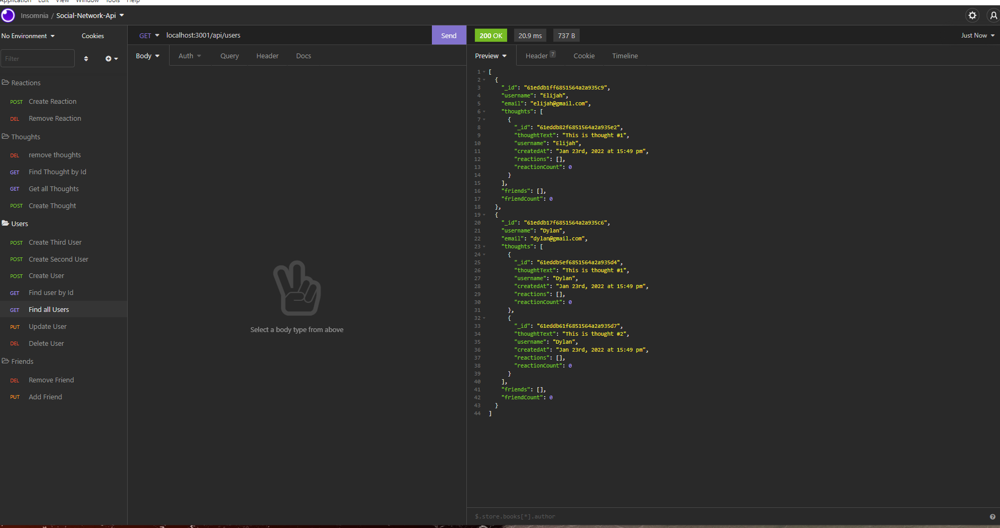

# Social-Network-API

## Description
This web application is a social network api, that allows users, to share their thoughts, as well as react to their friends thoughts, as well as create their own friend list. The technologies used in this application are, Express, MongoDB, Node, and Mongoose. 

## Table of Contents (Optional)
* [Installation](#installation)
* [Usage](#usage)
* [License](#license)
* [Contributing](#contributing)
* [Test](#test)
* [Questions](#questions)

## Installation
Clone the repo, then do "npm init", and "npm install". Next run "npm start" and open your Insomnia in order to test and create new data. 

## Usage
This is what it will look like on your device. 

[Screencastify](https://watch.screencastify.com/v/yb8FHnwqGjJqc88RLAVD)

## License 
N/A

## Contributing
Jennifer Lucas and also worked with Nick Kepers

## Tests 
N/A

## Questions
Please checkout my [Github](https://github.com/jenmlucas) for other projects. If you have any other questions or concerns, feel free to email me at jenmlucas1@gmail.com.
